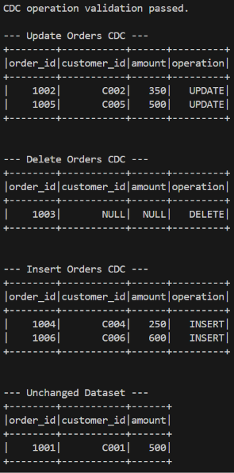
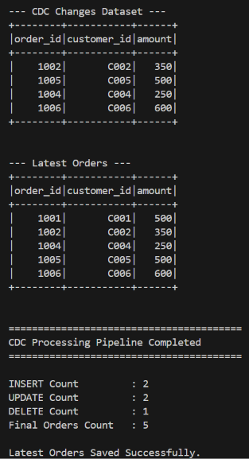

# PySpark Change Data Capture (CDC) Processing Pipeline

## Project Overview

A PySpark data engineering pipeline that processes Change Data Capture (CDC)
events and applies INSERT, UPDATE, and DELETE operations to an existing
orders dataset.

The pipeline reads an existing orders dataset from
`data/orders_existing.csv` and an incoming CDC log from
`data/orders_cdc.csv`. It validates the operation types, separates the CDC
events, removes outdated or deleted records, and combines the remaining
records with the new changes.

The final dataset is sorted by `order_id` and written to Parquet at
`output/latest_orders/`.

---

## Technologies

- Python 3.14
- Apache Spark 4.2
- PySpark 4.2

---

## Features

- **CDC Operation Validation:** Validates that incoming CDC events contain only INSERT, UPDATE, or DELETE operations. Invalid operations raise a `ValueError`.

- **CDC Event Separation:** Splits the CDC dataset into INSERT, UPDATE, and DELETE DataFrames using operation-based filtering.

- **Historical Record Filtering:** Uses chained `left_anti` joins to remove existing records whose `order_id` appears in DELETE or UPDATE events.

- **Name-Based DataFrame Union:** Removes the CDC `operation` column and combines unchanged, updated, and inserted records using `unionByName()`.

- **Parquet Export:** Writes the final orders dataset to `output/latest_orders/` in Parquet format.

---

## Project Structure

```text
33-pyspark-cdc-processing-pipeline/
├── data/
│   ├── orders_cdc.csv
│   └── orders_existing.csv
├── output/
│   └── latest_orders/
├── screenshots/
│   ├── output1.png
│   ├── output2.png
│   └── output3.png
├── src/
│   └── main.py
├── .gitignore
├── LICENSE
├── README.md
└── requirements.txt
```

---

## ETL Process

- **Extract & Inspect**

- Initializes a local SparkSession using `local[*]` execution.
- Reads the existing orders dataset and CDC dataset from CSV files using
  `header=True` and `inferSchema=True`.
- Displays sample rows and schemas for both datasets.

- **Transform (CDC Validation & State Reconciliation)**

- Operation Validation: Checks that every CDC event uses INSERT,
  UPDATE, or DELETE.
- CDC Event Separation: Splits the CDC dataset into INSERT, UPDATE,
  and DELETE DataFrames.
- Historical Record Filtering: Uses chained `left_anti` joins to remove
  existing records affected by DELETE or UPDATE events.
- State Merging: Removes the `operation` column from INSERT and UPDATE
  records, then combines them with unchanged records using `unionByName()`.
- Sorting: Orders the final dataset by `order_id`.

- **Load & Summary Metrics**

- Counts incoming INSERT, UPDATE, and DELETE CDC events.
- Counts the number of records in the final dataset.
- Writes the final orders dataset to `output/latest_orders/` in Parquet
  format using overwrite mode.

---

## Sample Output





---

## What I Learned

- Processing Change Data Capture (CDC) events in a batch PySpark pipeline.

- Validating CDC operation values before applying transformations.

- Using `left_anti` joins to remove existing records affected by updates or deletes.

- Combining unchanged, updated, and inserted records using `unionByName()`.

- Removing CDC metadata columns before producing the final dataset.

- Writing the final dataset to Parquet format.

--- 

## Future Improvements

- Delta Lake MERGE: Replace the manual anti-join and union logic with Delta Lake `MERGE INTO` operations to support transactional updates, deletes, and inserts.

- Event Sequencing and Deduplication: Add an event timestamp or sequence number to determine the correct order of multiple CDC events for the same `order_id`.

- Structured Streaming: Adapt the batch CDC logic to process continuous CDC events from Kafka or Debezium.

- Quarantine Strategy: Route rows failing CDC validation into an isolated quarantine or Dead Letter Queue (DLQ) directory rather than raising immediate runtime exceptions.

---

## Skills Demonstrated

- **CDC Processing:** INSERT, UPDATE, and DELETE event handling.

- **PySpark DataFrame Operations:** Filtering, joins, `left_anti`, `unionByName()`, column removal, and sorting.

- **Data Transformation:** Removing outdated records and applying incoming changes to an existing dataset.

- **Data Quality:** Validating CDC operation values and handling invalid operations.

- **Pipeline Monitoring:** Counting CDC events and final output records.

- **Data Storage:** Writing processed data to Parquet format.